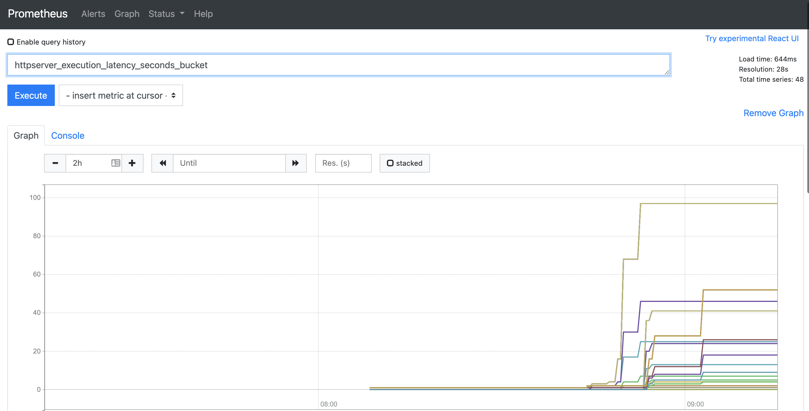

# httpserver

<details>
<summary></summary>
## tls
``` shell
sh gen-tls.sh # 生成密钥证书和secret.yaml配置
k apply -f secret.yaml
k apply -f service.yaml
k apply -f ingress.yaml
INGRESS_CONTROLLER_PORT=`k get svc ingress-nginx-controller -n ingress-nginx -oyaml| grep -A 6 https | grep nodePort| awk -n '{print $NF}'`
curl https://cncamp.com:$INGRESS_CONTROLLER_PORT --cacert "$(pwd)/tls.crt" --resolve "cncamp.com:$INGRESS_CONTROLLER_PORT:192.168.34.2"
```

## example
``` shell
docker run -p 8082:8080 -d vincent616/httpserver -v=1 -logtostderr=true
```

## Feature
1.当访问`localhost/foo`时，接收客户端 request，并将 request 中带的 header 写入 response header
2.读取当前系统的环境变量中的 VERSION 配置，并写入 response header
3.Server 端记录访问日志包括客户端 IP，HTTP 返回码，输出到 server 端的标准输出
4.当访问 localhost/healthz 时，应返回200

## Start
设置环境变量`VERSION`
日志级别：
  1. V1 -- 正常信息
  2. V2 -- bebug信息

``` shell
Usage of ./main:
  -alsologtostderr
        log to standard error as well as files
  -addr string
        specify the server binding addr
  -log_backtrace_at value
        when logging hits line file:N, emit a stack trace
  -log_dir string
        If non-empty, write log files in this directory
  -logtostderr
        log to standard error instead of files
  -stderrthreshold value
        logs at or above this threshold go to stderr
  -v value
        log level for V logs
  -vmodule value
        comma-separated list of pattern=N settings for file-filtered logging
```
</details>

<details>
<summary></summary>

## add grafana repo
``` shell
helm repo add grafana https://grafana.github.io/helm-charts
```

## download loki-stack
``` shell
helm pull grafana/loki-stack
tar -xvf loki-stack-2.5.0.tgz
# Kubernetes v1.22+需要替换rbac.authorization.k8s.io/v1beta1为rbac.authorization.k8s.io/v1
find ~/loki-stack -type f -exec sed -i s#rbac.authorization.k8s.io/v1beta1#rbac.authorization.k8s.io/v1#g {} +
helm upgrade --install loki ./loki-stack --set grafana.enabled=true,prometheus.enabled=true,prometheus.alertmanager.persistentVolume.enabled=false,prometheus.server.persistentVolume.enabled=false
```
## Prometheus查询示例


## grafana查询示例

</details>

<details>
<summary></summary>

## istio代理https
```shell
# 在namespaces中添加istio-injection=enabled标签，启用istio serviceMesh
# 要注意顺序，先建立pod后给namespace添加标签不会创建sidecar
kubectl label ns httpserver istio-injection=enabled
kubectl create -f httpserver.yaml
kubectl apply -f istio/secret.yml -n httpserver
kubectl apply -f istio/istio-specs.yaml -n httpserver
```

## istio analyze
``` shell
istioctl analyze -n httpserver # 分析istio相关配置
# Warning [IST0117] (Deployment toolbox.httpserver) No service associated with this deployment. Service mesh deployments must be associated with a service.
# 通过分析发现有个deployment没加service
```

## curl 访问
```shell
INGRESS_IP=$(k get svc istio-ingressgateway -nistio-system | awk  '/istio/ {print $3}')
# istio-ingressgateway必须通过指定域名访问，通过IP无法访问，header带Host也不行
curl --resolve cncamp.com:443:$INGRESS_IP https://cncamp.com/healthz -v -k
```
</details>
